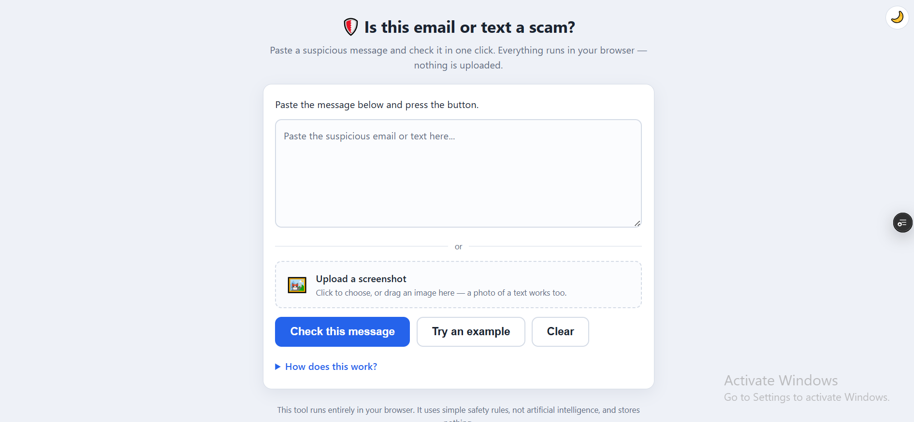

# Scam Message Analyzer


Paste a suspicious email and get a calm, plain-language explanation of **why**
it looks like a scam — written for a non-technical person (e.g. an elderly
relative). The goal is to teach instinct, not just block.

- **No AI, no API keys, no cost.** Every verdict comes from explainable rules.
- **Fully offline.** Nothing about the message ever leaves your machine.
- **Predictable.** The same email always gets the same answer — and you can
  read exactly why in `scam_message_analyzer/checks.py`.

**▶ Try it live:** <https://scam-message-analyzer-mu.vercel.app/> — it runs
entirely in your browser, so nothing you paste (or any screenshot you upload) is
sent to a server.



## How it works

1. **Deterministic checks** (`checks.py`) scan the message for known scam
   signals:
   - Link text that hides its real destination, and lookalike domains
     (`paypa1.ru`)
   - **Homograph domains** — non-Latin lookalike letters (Cyrillic `аpple.com`)
   - Raw-IP links, punycode, and URL shorteners
   - Sender/brand mismatches and Reply-To redirection
   - Urgency pressure and requests for PINs / gift cards / wire transfers
   - **Tech-support scares** ("your computer is infected") and **"call this
     number"** pressure
   - **Lottery / prize / inheritance** bait and suspiciously large amounts
   - **Risky attachments** (`.exe`, `.scr`, double extensions like
     `invoice.pdf.exe`, `.html`, `.zip`)
2. **Scoring** (`scoring.py`) rolls the signals into one traffic light:
   🔴 likely a scam · 🟡 be careful · 🟢 probably okay.
3. **Explanations** (`explanations.py`) turn each signal into one short,
   hand-written sentence plus a clear next step.

## Usage

```bash
# Check a saved email
python -m scam_message_analyzer email.txt

# Check a screenshot of a text or email (see OCR note below)
python -m scam_message_analyzer screenshot.png

# Or pipe it in
cat email.txt | python -m scam_message_analyzer
```

Accepts a full raw email (with `From:` / `Subject:` headers), just pasted body
text, or an image. No `pip install` needed — it runs on the standard library.

### Example

```text
$ python -m scam_message_analyzer suspicious.eml

🔴 LIKELY A SCAM

Here's what looks suspicious:
  • A link's web address ("verify-account.example") is built from official-sounding
    words like "account, verify" to look trustworthy, but it is not a real company's
    website. 👉 Don't click it, and don't enter any details there.
  • This message asks you to log in or confirm your account details ("verify your
    identity") through a link. Real companies don't ask you to verify your identity
    this way. 👉 Don't use the link — open the app or website you already trust instead.
  • This message tries to rush you ("immediately"). Scammers create panic so you act
    before you think. 👉 Slow down — real problems can wait for you to check.
  • The greeting is generic ("dear customer") instead of your real name.

When in doubt, do not click links or reply. Contact the company using a phone
number or website you already know and trust — never the ones in this message.
```

### Web app (easiest for non-technical people)

The CLI is fine for developers, but the person this tool protects won't type
commands. The web app (in `web/`) is a big paste box and one button — a
caregiver can bookmark it; the relative just pastes and clicks. It runs
**entirely in the browser**: the analysis happens on the device, so nothing is
uploaded.

Use the [hosted version](https://scam-message-analyzer-mu.vercel.app/), or run
it locally with any static server:

```bash
cd web
python -m http.server 8000
# then open http://localhost:8000
```

It is designed for a worried, non-technical person:

- **One paste box, one big button**, with a clear 🔴 / 🟡 / 🟢 verdict and a
  plain-language reason for each warning sign.
- **Upload a screenshot** — the text is read in the browser (and any QR code is
  decoded), so a photo of a text message works too.
- **Try an example** fills in a sample scam; **Clear** resets; **Save as PDF**
  keeps a copy (message, verdict, and reasons) to show someone you trust.
- **"How does this work?"** explains, in plain words, that it uses fixed rules
  (not AI) and sends nothing.
- Large text, keyboard focus rings, a **light/dark toggle**, and a responsive
  mobile layout. The text analysis uses **no external libraries**; reading a
  screenshot loads a text-recognition component on demand.

Prefer a Python server? `python -m scam_message_analyzer.web` runs the same
text checks from the standard library at <http://127.0.0.1:8765>.

### How it's deployed

The hosted demo is the static site in `web/`, deployed on Vercel via
`vercel.json` (which serves `web/` as static files). There is **no backend** —
the analysis runs in the visitor's browser, so even the hosted version never
uploads the message. Any static host (GitHub Pages, Netlify, …) works the same.

### Screenshots (OCR)

Most people who want a message checked have a *screenshot*, not its raw text.
Pass an image and the tool reads it with the local **Tesseract** OCR engine —
still fully offline, nothing uploaded. Tesseract is only needed for images;
text and `.eml` input work without it.

```bash
# Ubuntu/Debian
sudo apt install tesseract-ocr
# macOS
brew install tesseract
# Windows: https://github.com/UB-Mannheim/tesseract/wiki
```

If it isn't installed, the tool tells you how to get it. There are no Python
dependencies to install — the tool runs on the standard library alone.

**QR codes ("quishing").** Many scams now hide the link inside a QR code that
OCR can't read. If the optional `zbarimg` tool is installed
(`sudo apt install zbar-tools`), the tool decodes QR codes in a screenshot and
runs the hidden link through the same checks. It's a bonus — everything else
works without it.

## Tests

```bash
python -m unittest discover -s tests
```

## Optional, later: nicer phrasing

If you ever want softer, more natural wording, you can add a **local** model
(via Ollama) that only *rephrases* the already-decided findings — the verdict
never depends on it. Still free, still offline. Not included here on purpose:
fixed, vetted wording is safer for the people this tool is for.

## Why not just use an LLM?

For safety tooling aimed at vulnerable users, predictable beats fluent. A
hand-written rule can't hallucinate a reason or wrongly reassure someone about
a real scam, and no personal email gets sent to a third party.
